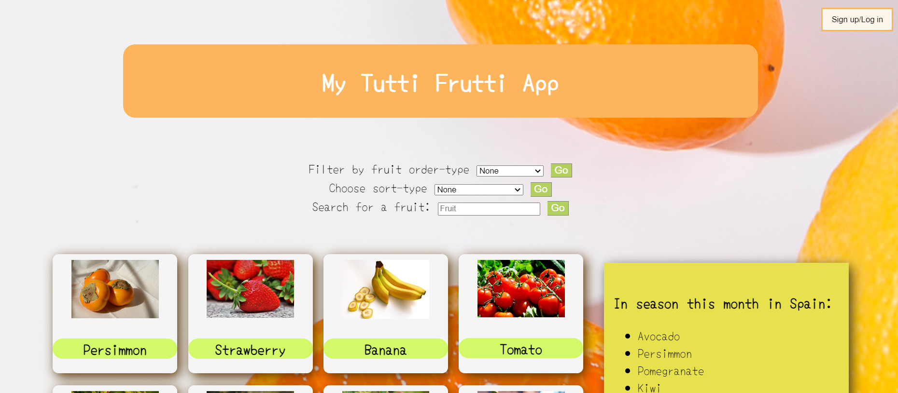
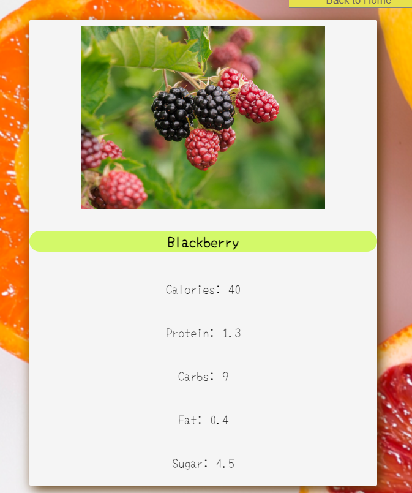
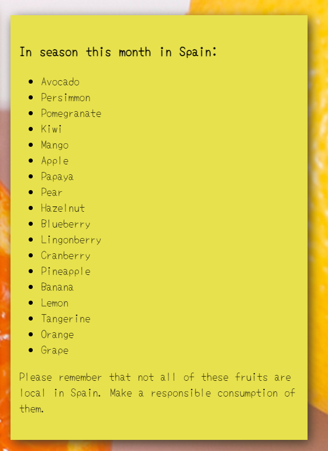
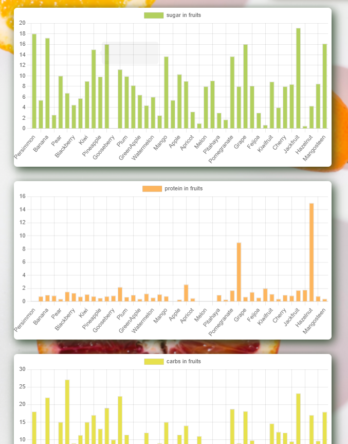
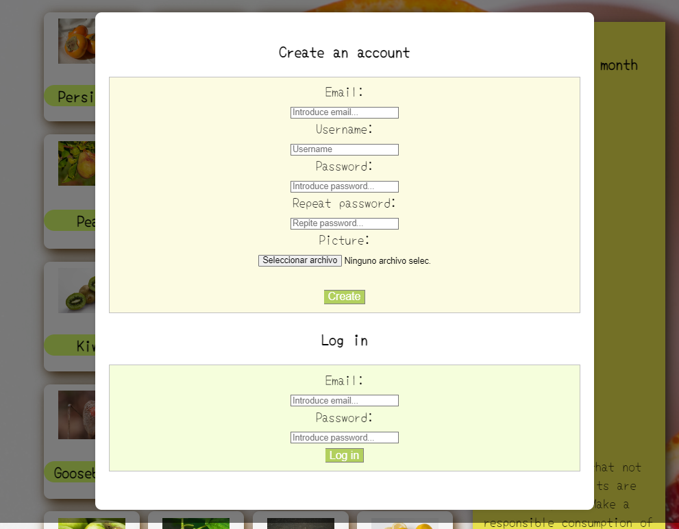
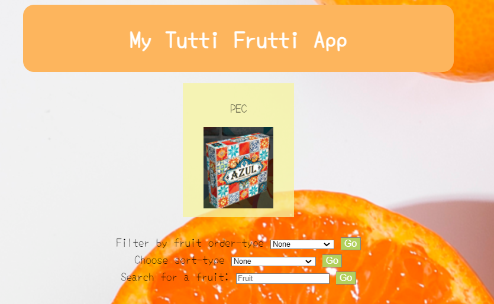
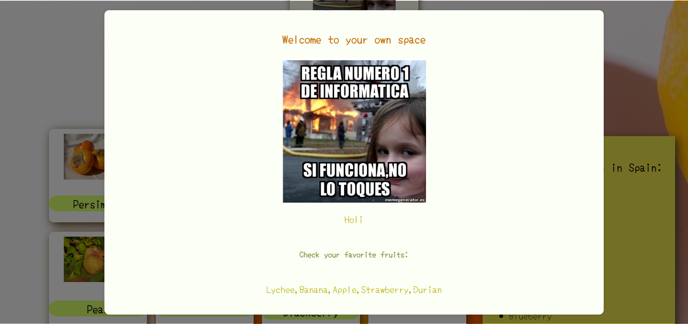

# My tutti Frutti App

visit page here: https://juhing-99.github.io/mytuttifruttiApp/

## Description

This project is part of the Full Stack Development bootcamp of The Bridge. It is an exercise to conclude the "FrontEnd" agenda block, so it is focused on this aspect of development.

This page fetches a Fruit API and displays its content on the page. In addition, the fruits that are in season in Spain are shown according to the month in which it is accessed. 

We can also find graphs at the end of the page that make us a visual comparison of the sugar/calories/... content in those fruits.

You can also register and log in as a user. Your profile image and username will then be displayed. You will also be able to access a personal user page where you can consult the fruits that you have previously saved as favorites. This section is still under development.

## Used in this project:

- HTML for structure
- CSS for styling, mobile first adapting and flexbox
- JS6 for  functions, API fetch, DOM manipulation.
- Firebase for Authentication and Firestore Database.
